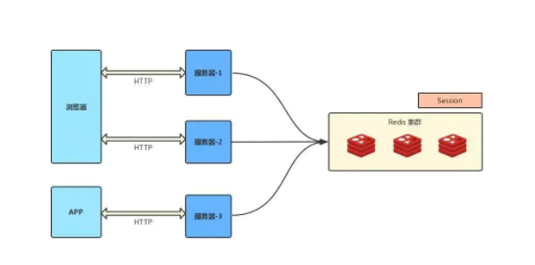

### 什么是 Session
- session 是另一种记录服务器和客户端会话状态的机制
- session 是基于 cookie 实现的，session 存储在服务器端，sessionId 会被存储到客户端的cookie 中

- session 认证流程：
1. 用户第一次请求服务器的时候，服务器根据用户提交的相关信息，创建对应的 Session请求返回时将此 Session 的唯一标识信息 SessionID 返回给浏览器
2. 浏览器接收到服务器返回的 SessionID 信息后，会将此信息存入到 Cookie 中，同时 Cookie 记录此 SessionID 属于哪个域名
3. 当用户第二次访问服务器的时候，请求会自动判断此域名下是否存在 Cookie 信息，如果存在自动将 Cookie 信息也发送给服务端，服务端会从 Cookie 中获取 SessionID，再根据 SessionID 查找对应的 Session 信息，如果没有找到说明用户没有登录或者登录失效，如果找到 Session 证明用户已经登录可执行后面操作。

根据以上流程可知，**SessionID 是连接 Cookie 和 Session 的一道桥梁**，大部分系统也是根据此原理来验证用户登录状态。

### 使用 session 时需要考虑的问题
1. 将 session 存储在服务器里面，当用户同时在线量比较多时，这些 **session 会占据较多的内存，需要在服务端定期的去清理过期的 session**
2. **当网站采用集群部署的时候，会遇到多台 web 服务器之间如何做 session 共享的问题**。因为 session 是由单个服务器创建的，但是处理用户请求的服务器不一定是那个创建 session 的服务器，那么该服务器就无拿到之前已经放入到 session 中的登录凭证之类的信息了。
3. **当多个应用要共享 session 时，除了以上问题，还会遇到跨域问题**，因为不同的应用可能部署的主机不一样，需要在各个应用做好 cookie 跨域的处理。
4. sessionId 是存储在 cookie 中的，**假如浏览器禁止 cookie 或不支持 cookie 怎么办？** 一般会把 sessionId 跟在 url 参数后面即重写 url，所以 session 不一定非得需要靠 cookie 实现
5. **移动端对 cookie 的支持不是很好**，而 session 需要基于 cookie 实现，所以移动端常用的是 token

### 分布式架构下 session 共享方案
1. **session 复制**
   
   > 任何一个服务器上的 session 发生改变（增删改），该节点会把这个 session 的所有内容序列化，然后广播给所有其它节点，不管其他服务器需不需要 session ，以此来保证 session 同步

**优点**： 可容错，各个服务器间 session 能够实时响应。

**缺点**： 会对网络负荷造成一定压力，如果 session 量大的话可能会造成网络堵塞，拖慢服务器性能。

2. **粘性 session /IP 绑定策略**

> 采用 Ngnix 中的 ip_hash 机制，将某个 ip的所有请求都定向到同一台服务器上，即将用户与服务器绑定。 用户第一次请求时，负载均衡器将用户的请求转发到了 A 服务器上，如果负载均衡器设置了粘性 session 的> 话，那么用户以后的每次请求都会转发到 A 服务器上，相当于把用户和 A 服务器粘到了一块，这就是粘性 session 机制。

**优点**： 简单，不需要对 session 做任何处理。

**缺点**： 缺乏容错性，如果当前访问的服务器发生故障，用户被转移到第二个服务器上时，他的 session 信息都将失效。

**适用场景**： 发生故障对客户产生的影响较小；服务器发生故障是低概率事件。

**实现方式**： 以 Nginx 为例，在 upstream 模块配置 ip_hash 属性即可实现粘性 session。

3. **session 共享（常用）**
 
使用分布式缓存方案比如 Memcached 、Redis 来缓存 session，但是要求 Memcached 或 Redis 必须是集群。

把 session 放到 Redis 中存储，虽然架构上变得复杂，并且需要多访问一次 Redis ，但是这种方案带来的好处也是很大的：
 - 实现了 session 共享；
 - 可以水平扩展（增加 Redis 服务器）；
 - 服务器重启 session 不丢失（不过也要注意 session 在 Redis 中的刷新/失效机制）；
 - 不仅可以跨服务器 session 共享，甚至可以跨平台（例如网页端和 APP 端）

4. **session 持久化**

> 将 session 存储到数据库中，保证 session 的持久化

**优点**： 服务器出现问题，session 不会丢失

**缺点**： 如果网站的访问量很大，把 session 存储到数据库中，会对数据库造成很大压力，还需要增加额外的开销维护数据库。

### 只要关闭浏览器 ，session 真的就消失了？
1. 对 session 来说，除非程序通知服务器删除一个 session，否则服务器会一直保留
2. 服务器根本不会有机会知道浏览器已经关闭
3. 大部分 session 机制都使用会话 cookie 来保存 session id，而关闭浏览器后这个 session id 就消失了，再次连接服务器时也就无法找到原来的 session
4. 如果服务器设置的 cookie 被保存在硬盘上，或者使用某种手段改写浏览器发出的 HTTP 请求头，把原来的 session id 发送给服务器，则再次打开浏览器仍然能够打开原来的 session。
5. 由于关闭浏览器不会导致 session 被删除，迫使服务器为 session 设置了一个失效时间，当距离客户端上一次使用 session 的时间超过这个失效时间时，服务器就认为客户端已经停止了活动，才会把 session 删除以节省存储空间。