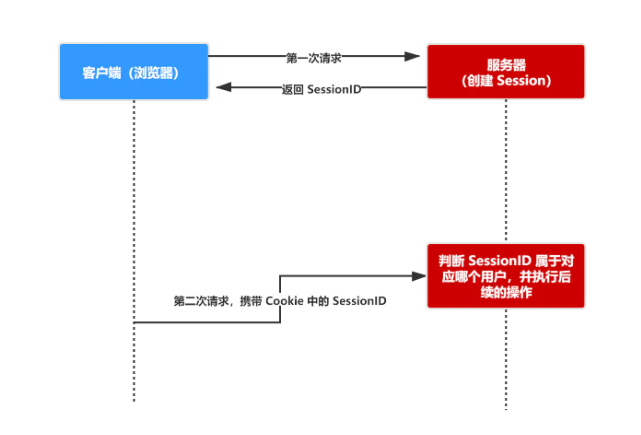

### 什么是 Session
- session 是另一种记录服务器和客户端会话状态的机制
- session 是基于 cookie 实现的，session 存储在服务器端，sessionId 会被存储到客户端的cookie 中

- session 认证流程：
1. 用户第一次请求服务器的时候，服务器根据用户提交的相关信息，创建对应的 Session请求返回时将此 Session 的唯一标识信息 SessionID 返回给浏览器
2. 浏览器接收到服务器返回的 SessionID 信息后，会将此信息存入到 Cookie 中，同时 Cookie 记录此 SessionID 属于哪个域名
3. 当用户第二次访问服务器的时候，请求会自动判断此域名下是否存在 Cookie 信息，如果存在自动将 Cookie 信息也发送给服务端，服务端会从 Cookie 中获取 SessionID，再根据 SessionID 查找对应的 Session 信息，如果没有找到说明用户没有登录或者登录失效，如果找到 Session 证明用户已经登录可执行后面操作。

根据以上流程可知，**SessionID 是连接 Cookie 和 Session 的一道桥梁**，大部分系统也是根据此原理来验证用户登录状态。
