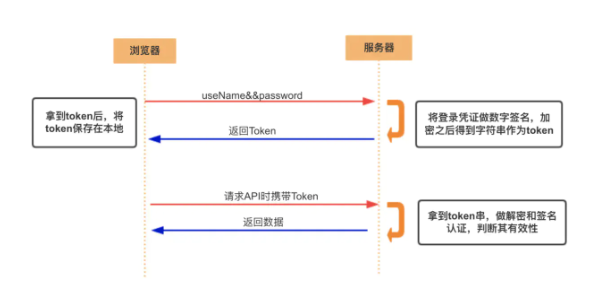

### 什么是 Token（令牌）
#### 一、Acesss Token
- 访问资源接口（API）时所需要的资源凭证
- 简单 token 的组成： uid(用户唯一的身份标识)、time(当前时间的时间戳)、sign（签名，token 的前几位以哈希算法压缩成的一定长度的十六进制字符串）
- 特点：
1. 服务端无状态化、可扩展性好
2. 支持移动端设备
3. 安全
4. 支持跨程序调用
- token 的身份验证流程：

1. 客户端使用用户名跟密码请求登录
2. 服务端收到请求，去验证用户名与密码
3. 验证成功后，服务端会签发一个 token 并把这个 token 发送给客户端
4. 客户端收到 token 以后，会把它存储起来，比如放在 cookie 里或者 localStorage 里
5. 客户端每次向服务端请求资源的时候需要带着服务端签发的 token
6. 服务端收到请求，然后去验证客户端请求里面带着的 token ，如果验证成功，就向客户端返回请求的数据

token的用法与好处：
- 每一次请求都需要携带 token，需要把 token 放到 HTTP 的 Header 里
- 基于 token 的用户认证是一种服务端无状态的认证方式，服务端不用存放 token 数据。用解析 token 的计算时间换取 session 的存储空间，从而减轻服务器的压力，减少频繁的查询数据库
- token 完全由应用管理，所以它可以避开同源策略

#### 二、Refresh Token
- refresh token 是专用于刷新 access token 的 token，refresh token可以做到用户无感知的获取最新access token
- Access Token 的有效期比较短，当 Acesss Token 由于过期而失效时，使用 Refresh Token 就可以获取到新的 Token，如果 Refresh Token 也失效了，用户就只能重新登录了。
- Refresh Token 及过期时间是存储在服务器的数据库中，只有在申请新的 Acesss Token 时才会验证，不会对业务接口响应时间造成影响，也不需要向 Session 一样一直保持在内存中以应对大量的请求。

### 使用 token 时需要考虑的问题
1. 如果你认为用数据库来存储 token 会导致查询时间太长，**可以选择放在内存当中**。比如 **redis** 很适合你对 token 查询的需求。
2. token 完全由应用管理，所以它**可以避开同源策略**
3. token **可以避免 CSRF 攻击**(因为不需要 cookie 了)
4. 移动端对 cookie 的支持不是很好，而 session 需要基于 cookie 实现，所以**移动端常用的是 token**