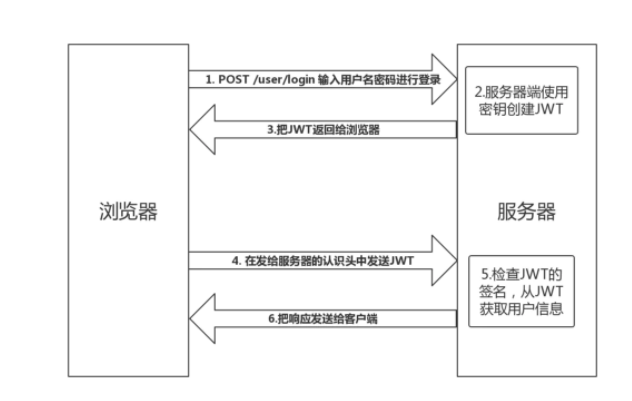

### 什么是 JWT
- JSON Web Token（简称 JWT）是目前**最流行的跨域认证解决方案**。
- 是一种**认证授权机制**。
- JWT 是为了在网络应用环境间传递声明而执行的一种基于 JSON 的开放标准（RFC 7519）。JWT 的声明一般被用来在身份提供者和服务提供者间传递被认证的用户身份信息，以便于从资源服务器获取资源。比如用在用户登录上。
- 可以使用 HMAC 算法或者是 RSA 的公/私秘钥对 JWT 进行签名。因为数字签名的存在，这些传递的信息是可信的。



### 一、JWT 认证流程：
1. 用户输入用户名/密码登录，服务端认证成功后，会返回给客户端一个 JWT
2. 客户端将 token 保存到本地（通常使用 localstorage，也可以使用 cookie）
3. 当用户希望访问一个受保护的路由或者资源的时候，需要请求头的 Authorization 字段中使用Bearer 模式添加 JWT，其内容看起来是下面这样

```
Authorization: Bearer <token>
```
### 二、JWT 的使用方式
1. 放在 HTTP 请求头信息的 Authorization 字段里，使用 Bearer 模式添加 JWT。
2. 跨域的时候，可以把 JWT 放在 POST 请求的数据体里。
3. 通过 URL 传输（拼在请求后面）

### 三、为什么使用JWT
- 因为 JWT 是自包含的（内部包含了一些会话信息），因此**减少了需要查询数据库的需要**
- 因为 JWT 并不使用 Cookie 的，所以你可以使用任何域名提供你的 API 服务而**不需要担心跨域资源共享问题（CORS）**
- 因为用户的状态不再存储在服务端的内存中，所以这**是一种无状态的认证机制**

### 使用 JWT 时需要考虑的问题
1. 因为 JWT 并不依赖 Cookie 的，所以你可以使用任何域名提供你的 API 服务而**不需要担心跨域资源共享问题（CORS）**
2. JWT 默认是不加密，但也是可以加密的。生成原始 Token 以后，可以用密钥再加密一次。
3. JWT 不加密的情况下，不能将秘密数据写入 JWT。
4. JWT 不仅可以用于认证，也可以用于交换信息。有效使用 JWT，可以降低服务器查询数据库的次数。
5. **JWT 最大的优势是服务器不再需要存储 Session，使得服务器认证鉴权业务可以方便扩展。但这也是 JWT 最大的缺点：由于服务器不需要存储 Session 状态，因此使用过程中无法废弃某个 Token 或者更改 Token 的权限。也就是说一旦 JWT 签发了，到期之前就会始终有效，除非服务器部署额外的逻辑**。
6. JWT 本身包含了认证信息，一旦泄露，任何人都可以获得该令牌的所有权限。为了减少盗用，**JWT的有效期应该设置得比较短。对于一些比较重要的权限，使用时应该再次对用户进行认证**。
7. **JWT 适合一次性的命令认证**，颁发一个有效期极短的 JWT，即使暴露了危险也很小，由于每次操作都会生成新的 JWT，因此也没必要保存 JWT，真正实现无状态。
8. 为了减少盗用，JWT 不应该使用 HTTP 协议明码传输，**要使用 HTTPS 协议传输**。