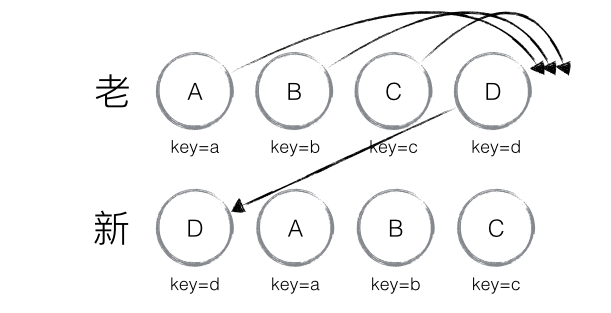

### Element diff
---
> 策略三：对于同一层级的一组子节点，它们可以通过唯一 id 进行区分。

当节点处于同一层级时，React diff 提供了三种节点操作，分别为：INSERT_MARKUP（插入）、MOVE_EXISTING（移动）和 REMOVE_NODE（删除）。

新老集合进行 diff 差异化对比，通过 key 发现新老集合中的节点都是相同的节点，因此无需进行节点删除和创建，只需要将老集合中节点的位置进行移动，更新为新集合中节点的位置

当然，React diff 还是存在些许不足与待优化的地方，如下图所示，若新集合的节点更新为：D、A、B、C，与老集合对比只有 D 节点移动，而 A、B、C 仍然保持原有的顺序，理论上 diff 应该只需对 D 执行移动操作，然而由于 D 在老集合的位置是最大的，导致其他节点的 _mountIndex < lastIndex，造成 D 没有执行移动操作，而是 A、B、C 全部移动到 D 节点后面的现象。

>建议：在开发过程中，尽量减少类似将最后一个节点移动到列表首部的操作，当节点数量过大或更新操作过于频繁时，在一定程度上会影响 React 的渲染性能。