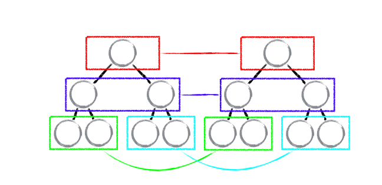
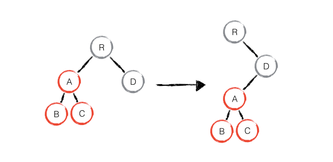

### Tree diff
---
> 策略一：Web UI 中 DOM 节点跨层级的移动操作特别少，可以忽略不计。

基于策略一，React 对树的算法进行了简洁明了的优化，即对树进行分层比较，两棵树只会对同一层次的节点进行比较。

既然 DOM 节点跨层级的移动操作少到可以忽略不计，针对这一现象，React 通过 updateDepth 对 Virtual DOM 树进行层级控制，只会对相同颜色方框内的 DOM 节点进行比较，即同一个父节点下的所有子节点。**当发现节点已经不存在，则该节点及其子节点会被完全删除掉，不会用于进一步的比较。这样只需要对树进行一次遍历，便能完成整个 DOM 树的比较。**

如果出现了 DOM 节点跨层级的移动操作，React diff 会有怎样的表现呢？

此时，React diff 的执行情况：create A -> create B -> create C -> delete A。

由此可发现，**当出现节点跨层级移动时，并不会出现想象中的移动操作，而是以 A 为根节点的树被整个重新创建，这是一种影响 React 性能的操作，因此 React 官方建议不要进行 DOM 节点跨层级的操作。**

总结：

**在开发组件时，保持稳定的 DOM 结构会有助于性能的提升**。例如，可以通过 CSS 隐藏或显示节点，而不是真的移除或添加 DOM 节点。
