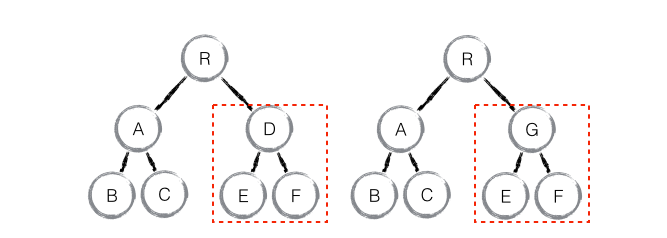

### Diff算法-component
---
> 策略二：拥有相同类的两个组件将会生成相似的树形结构，拥有不同类的两个组件将会生成不同的树形结构。

React 是基于组件构建应用的，对于组件间的比较所采取的策略也是简洁高效。

> 如果是同一类型的组件，按照原策略继续比较 virtual DOM tree。

> 如果不是，则将该组件判断为 dirty component，从而替换整个组件下的所有子节点。

> 对于同一类型的组件，有可能其 Virtual DOM 没有任何变化，如果能够确切的知道这点那可以节省大量的 diff 运算时间，因此 React 允许用户通过 shouldComponentUpdate() 来判断该组件是否需要进行 diff。

如下图，当 component D 改变为 component G 时，即使这两个 component **结构相似**，一旦 React 判断 D 和 G 是**不同类型**的组件，就不会比较二者的结构，而是**直接删除** component D，重新创建 component G 以及其子节点。虽然当两个 component 是不同类型但结构相似时，React diff 会影响性能，但正如 React 官方博客所言：**不同类型的 component 是很少存在相似 DOM tree 的机会，因此这种极端因素很难在实现开发过程中造成重大影响的。**

