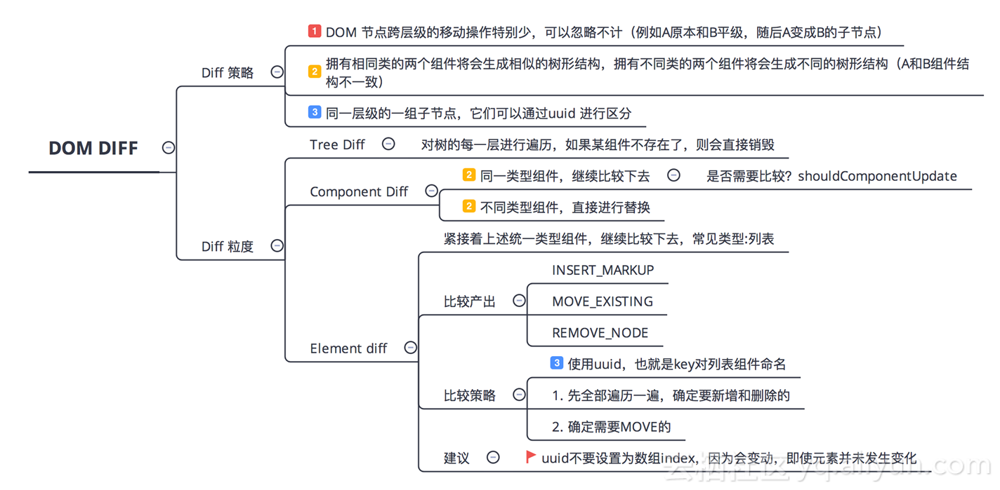

### Diff算法
---

> 参考链接 [React 源码剖析系列 － 不可思议的 react diff](https://zhuanlan.zhihu.com/p/20346379?refer=purerender)
#### 一、为什么要有Diff算法
React diff 会帮助我们计算出 Virtual DOM 中真正变化的部分，并只针对该部分进行实际 DOM 操作，而非重新渲染整个页面，从而保证了每次操作更新后页面的高效渲染

#### 二、传统 diff 算法
传统 diff 算法通过循环递归对节点进行依次对比，效率低下，算法复杂度达到 O(n^3)，其中 n 是树中节点的总数

#### 三、React diff
传统 diff 算法的复杂度为 O(n^3)，显然这是无法满足性能要求的。**React 通过制定大胆的策略，将 O(n^3) 复杂度的问题转换成 O(n) 复杂度的问题。**

**diff 策略**
1. Web UI 中 DOM 节点跨层级的移动操作特别少，可以忽略不计。
2. 拥有相同类的两个组件将会生成相似的树形结构，拥有不同类的两个组件将会生成不同的树形结构。
3. 对于同一层级的一组子节点，它们可以通过唯一 id 进行区分。

基于以上三个前提策略，**React 分别对 tree diff、component diff 以及 element diff 进行算法优化，执行时按顺序依次执行**。R事实也证明这三个前提策略是合理且准确的，它保证了整体界面构建的性能。
> tree diff
> 
> component diff
> 
> element diff

#### 四、总结
> React 通过制定大胆的 diff 策略，将 O(n3) 复杂度的问题转换成 O(n) 复杂度的问题；
> 
> React 通过分层求异的策略，对 tree diff 进行算法优化；
> 
> React 通过相同类生成相似树形结构，不同类生成不同树形结构的策略，对 component diff 进行算法优化；
> 
> React 通过设置唯一 key的策略，对 element diff 进行算法优化；

#### 五、建议
**在开发组件时，保持稳定的 DOM 结构会有助于性能的提升**

**在开发过程中，尽量减少类似将最后一个节点移动到列表首部的操作，当节点数量过大或更新操作过于频繁时，在一定程度上会影响 React 的渲染性能**