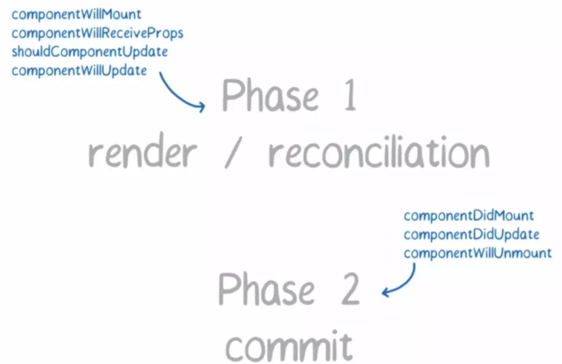
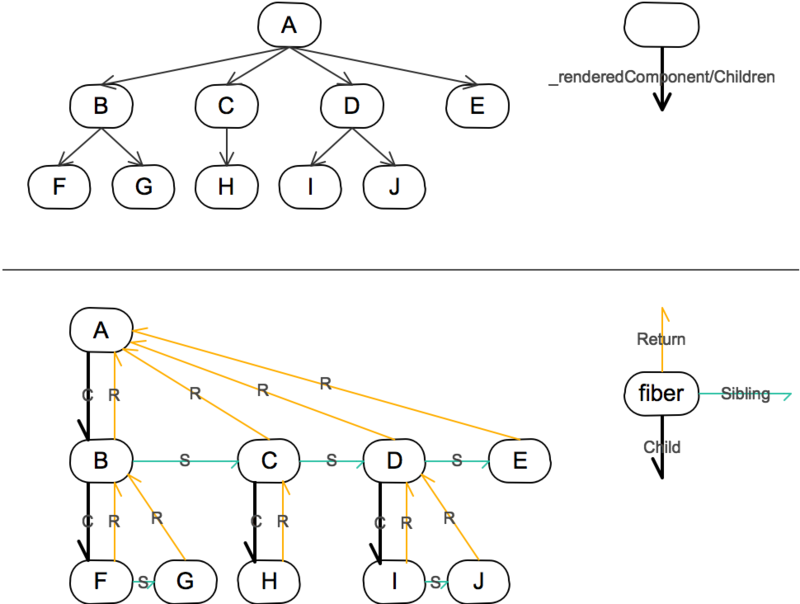

## React Fiber

### 参考文档
- [React Fiber 原理介绍](https://segmentfault.com/a/1190000018250127)
- [React Fiber是什么](https://zhuanlan.zhihu.com/p/26027085)

### 前言

**React Fiber是react执行渲染时的一种新的调度策略，Diff 运算的调度器**，JavaScript是单线程的，一旦组件开始更新，主线程就一直被React控制，这个时候如果再次执行交互操作，就会卡顿。

React Fiber重构这种方式，渲染过程采用切片的方式，每执行一会儿，就歇一会儿。如果有优先级更高的任务到来以后呢，就会先去执行，降低页面发生卡顿的可能性，使得React对动画等实时性要求较高的场景体验更好。

### 一、React 15 的问题
在页面元素很多，且需要频繁刷新的场景下，React 15 会出现掉帧的现象。

其根本原因，是**大量的同步计算任务阻塞了浏览器的 UI 渲染**。默认情况下，JS 运算、页面布局和页面绘制都是运行在浏览器的主线程当中，他们之间是互斥的关系。如果 JS 运算持续占用主线程，页面就没法得到及时的更新。当我们调用setState更新页面的时候，React 会遍历应用的所有节点，计算出差异，然后再更新 UI。整个过程是一气呵成，不能被打断的。如果页面元素很多，整个过程占用的时机就可能超过 16 毫秒，就容易出现掉帧的现象。

### 二、解题思路

**解决主线程长时间被 JS 运算占用这一问题的基本思路，是将运算切割为多个步骤，分批完成。也就是说在完成一部分任务之后，将控制权交回给浏览器，让浏览器有时间进行页面的渲染。等浏览器忙完之后，再继续之前未完成的任务。**

旧版 React 通过递归的方式进行渲染，使用的是 JS 引擎自身的函数调用栈，它会一直执行到栈空为止。而Fiber实现了自己的组件调用栈，它以链表的形式遍历组件树，可以灵活的暂停、继续和丢弃执行的任务。实现方式是使用了浏览器的`requestIdleCallback`这一 API。官方的解释是这样的：

> window.requestIdleCallback()会在浏览器空闲时期依次调用函数，这就可以让开发者在主事件循环中执行后台或低优先级的任务，而且不会对像动画和用户交互这些延迟触发但关键的事件产生影响。函数一般会按先进先调用的顺序执行，除非函数在浏览器调用它之前就到了它的超时时间。

### 三、React 的答卷

React 框架内部的运作可以分为 3 层：

- Virtual DOM 层，描述页面长什么样。
- **Reconciler 层，负责调用组件生命周期方法，进行 Diff 运算等。**
- Renderer 层，根据不同的平台，渲染出相应的页面，比较常见的是 ReactDOM 和 ReactNative。
这次改动最大的当属 Reconciler 层了，React 团队也给它起了个新的名字，叫Fiber Reconciler。这就引入另一个关键词：Fiber。

Fiber 其实指的是一种数据结构，它可以用一个纯 JS 对象来表示：
```
const fiber = {
    stateNode,    // 节点实例
    child,        // 子节点
    sibling,      // 兄弟节点
    return,       // 父节点
}
```

以前的 Reconciler 被命名为Stack Reconciler。Stack Reconciler 运作的过程是不能被打断的，必须一条道走到黑


而 **Fiber Reconciler 每执行一段时间，都会将控制权交回给浏览器，可以分段执行：**


为了达到这种效果，就需要有一个**调度器 (Scheduler) 来进行任务分配**。任务的优先级有六种：

- synchronous，与之前的Stack Reconciler操作一样，同步执行
- task，在next tick之前执行
- animation，下一帧之前执行
- high，在不久的将来立即执行
- low，稍微延迟执行也没关系
- offscreen，下一次render时或scroll时才执行


优先级高的任务（如键盘输入）可以打断优先级低的任务（如Diff）的执行，从而更快的生效。

Fiber Reconciler 在执行过程中，会分为 2 个阶段。


- 阶段一，生成 Fiber 树，得出需要更新的节点信息。这一步是一个渐进的过程，可以被打断。
- 阶段二，将需要更新的节点一次过批量更新，这个过程不能被打断。


**阶段一可被打断的特性，让优先级更高的任务先执行，从框架层面大大降低了页面掉帧的概率。**

### 四、Fiber 树
Fiber Reconciler 在阶段一进行 Diff 计算的时候，会生成一棵 Fiber 树。这棵树是在 Virtual DOM 树的基础上增加额外的信息来生成的，它本质来说是一个链表。


Fiber 树在首次渲染的时候会一次过生成。在后续需要 Diff 的时候，会根据已有树和最新 Virtual DOM 的信息，生成一棵新的树。**这颗新树每生成一个新的节点，都会将控制权交回给主线程，去检查有没有优先级更高的任务需要执行。如果没有，则继续构建树的过程：**


如果过程中有优先级更高的任务需要进行，则 Fiber Reconciler 会丢弃正在生成的树，在空闲的时候再重新执行一遍。

**在构造 Fiber 树的过程中，Fiber Reconciler 会将需要更新的节点信息保存在Effect List当中，在阶段二执行的时候，会批量更新相应的节点。**

### 五、总结
从Stack Reconciler到Fiber Reconciler，源码层面其实就是干了一件递归改循环的事情