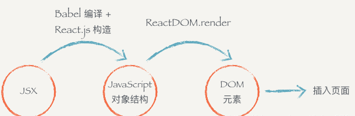

### 深入 JSX
---
> jsx是JavaScript的一种语法扩展，它跟模板语言很接近，但是它充分具备JavaScript的能力
#### 概览：
1. JSX 仅仅只是 `React.createElement(component, props, ...children)` 函数的语法糖
2. JSX到渲染dom分三步：jsx转js对象(babel)、js对象转dom(ReactDom.render)、渲染到浏览器
3. 不直接从 JSX 直接渲染构造 DOM 结构, 而是多了一步生成js对象，是有很多好处的。

#### 一、babel编译
每个 DOM 元素的结构都可以用 JavaScript 的对象来表示。你会发现一个 DOM 元素包含的信息其实只有三个：**标签名，属性，子元素**。
React.js 就把 JavaScript 的语法扩展了一下，让 JavaScript 语言能够支持这种直接在 JavaScript 代码里面编写类似 HTML 标签结构的语法，这样写起来就方便很多了。**编译的过程会把类似 HTML 的 JSX 结构转换成 JavaScript 的对象结构。**

编译前：
```
class Header extends Component {
  render () {
    return (
      <div>
        <h1 className='title'>React 小书</h1>
      </div>
    )
  }
}

ReactDOM.render(
  <Header />,
  document.getElementById('root')
)
```
编译后：
```
class Header extends Component {
  render () {
    return (
     React.createElement(
        "div",
        null,
        React.createElement(
          "h1",
          { className: 'title' },
          "React 小书"
        )
      )
    )
  }
}

ReactDOM.render(
  React.createElement(Header, null), 
  document.getElementById('root')
);
```

#### 二、ReactDom.render()渲染
ReactDOM.render 功能就是把组件渲染并且构造 DOM 树，然后插入到页面上某个特定的元素上（在这里是 id 为 root 的 div 元素）
```
ReactDOM.render(
  <Header />,
  document.getElementById('root')
)
```

#### 三、jsx渲染到页面的过程


1. **基于babel-preset-react-app把JSX语法变为React.createElement的模式**
   - 只要遇到元素标签（或组件）都要调用createElement
   - createElement的前两个参数是固定的：标签名（组件名）、属性，第三个及以后的参数是子元素
如果传递了属性，第二个参数是一个对象（包含了各属性的信息），没有传递属性则第二个参数为null
2. **基于React.createElement方法执行创建出虚拟DOM对象（JSX对象）**
   - 首先创建一个对象
   - type属性存储的是标签名或组件
   - props属性：如果没有传递任何属性，也没有任何子元素，则为空对象；把传递的createElement的属性，都赋值给props；如果有子元素则新增一个children属性，可能是一个值也可能是一个数组
3. **基于ReactDOM.render把创建的虚拟DOM对象渲染到页面指定的容器中**
   - ReactDOM.render([jsxObj],[container],[callback])，render接收三个参数：jsx对象，页面指定的容器和回调函数（可不传）
   - callback渲染触发的回调函数，在这里可以获取到真实DOM


#### 四、为什么不直接从 JSX 直接渲染构造 DOM 结构，而是要经过中间这么一层呢
1. **易复用**: 当我们拿到一个表示 UI 的结构和信息的对象以后，不一定会把元素渲染到浏览器的普通页面上，我们有可能把这个结构渲染到 canvas 上，或者是手机 App 上。所以这也是为什么会要把 react-dom 单独抽离出来的原因，可以想象有一个叫 react-canvas 可以帮我们把 UI 渲染到 canvas 上，或者是有一个叫 react-app 可以帮我们把它转换成原生的 App（实际上这玩意叫 ReactNative）
2. **虚拟dom**: 当数据变化，需要更新组件的时候，就可以用比较快的算法操作这个 JavaScript 对象，而不用直接操作页面上的 DOM，这样可以尽量少的减少浏览器重排，极大地优化性能
3. **JSX 的防注入攻击**：React DOM 在渲染所有输入内容之前，默认会进行转义。它可以确保在你的应用中，永远不会注入那些并非自己明确编写的内容。所有的内容在渲染之前都被转换成了字符串。这样可以有效地防止 XSS（cross-site-scripting, 跨站脚本）攻击，使你在 JSX 当中插入用户输入内容更安全。


#### 五、全新的 JSX 转换
为什么要用全新的JSX转换?
> 如果使用 JSX，则需在 React 的环境下，因为 JSX 将被编译成 React.createElement，新版本的jsx编译功能单独抽离出来。
> 
> 有一些 React.createElement 无法做到的性能优化和简化。


新的 JSX 转换不会将 JSX 转换为 React.createElement，而是自动从 React 的 package 中引入新的入口函数并调用。

假设你的源代码如下：
```
function App() {
  return <h1>Hello World</h1>;
}
```
下方是新 JSX 被转换编译后的结果：
```
// 由编译器引入（禁止自己引入！）
import {jsx as _jsx} from 'react/jsx-runtime';

function App() {
  return _jsx('h1', { children: 'Hello world' });
}
```

升级它会为你带来一些好处：
- 使用全新的转换，你可以单独使用 JSX 而无需引入 React。
- 根据你的配置，JSX 的编译输出可能会略微改善 bundle 的大小。
- 它将减少你需要学习 React 概念的数量，以备未来之需。