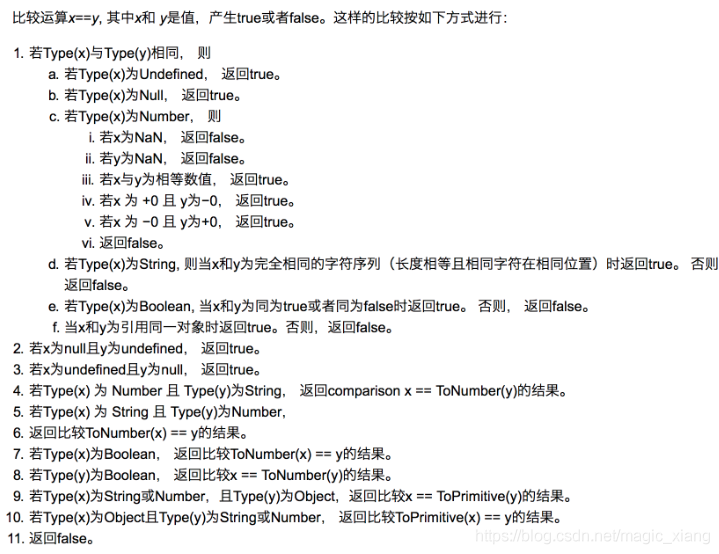

## 解析[] == ![]为true，而 {} == !{}却为false

### js基本转换规则

### [] == ![] 结果为什么是true

1、根据运算符优先级，! 优先级大于 == ，所以先执行 ![]

! 将变量转换成boolean类型，null、undefined、NaN以及空字符串取反都为true，其余为false，所以![]运算结果为false。 => [] == false

2、根据基本转换规则，若一个操作数是布尔值，需先将其转换成数值，false转为0，true转为1。=> [] == 0

3、若一个操作数是对象，另一个操作数不是，则调用对象的valueOf()方法，用得到的基本类型值按照前面的规则进行比较，如果对象没有valueOf()方法，则调用 toString();[].toString()结果为空字符串。=> '' == 0

4、若一个操作数是字符串，另一个操作数是数值，在比较相等性之前先将字符串转换为数值；Number('')为0。=> 0 == 0，结果为true

所以 [] == ![] 为true

### {} == !{} 结果为什么是false

同上，但是{}.toString()结果为NaN，如果一个操作数是NaN，则相等操作符返回false

所以{} == !{}为false