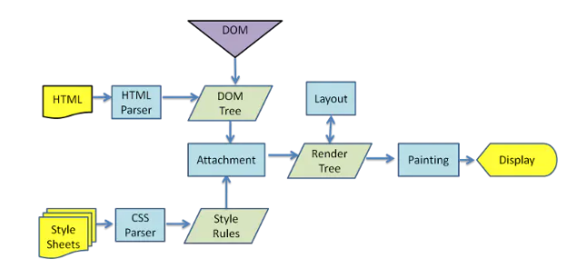
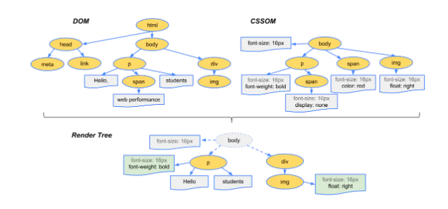

### 一：浏览器的渲染过程

从上面这个图上，我们可以看到，浏览器渲染过程如下：
1. 解析HTML，生成DOM树，解析CSS，生成CSSOM树
2. 将DOM树和CSSOM树结合，生成渲染树(Render Tree)
3. Layout(回流):根据生成的渲染树，进行回流(Layout)，得到节点的几何信息（位置，大小）
4. Painting(重绘):根据渲染树以及回流得到的几何信息，得到节点的绝对像素
5. Display:将像素发送给GPU，展示在页面上。（这一步其实还有很多内容，比如会在GPU将多个合成层合并为同一个层，并展示在页面中。而css3硬件加速的原理则是新建合成层）

#### 第一步：生成渲染树

为了构建渲染树，浏览器主要完成了以下工作：
1. 从DOM树的根节点开始遍历每个可见节点。
2. 对于每个可见的节点，找到CSSOM树中对应的规则，并应用它们。
3. 根据每个可见节点以及其对应的样式，组合生成渲染树。
   
第一步中，既然说到了要遍历可见的节点，那么我们得先知道，什么节点是不可见的。不可见的节点包括：

- 一些不会渲染输出的节点，比如script、meta、link等。
- 一些通过css进行隐藏的节点。比如display:none。注意，利用visibility和opacity隐藏的节点，还是会显示在渲染树上的。只有display:none的节点才不会显示在渲染树上。
  
从上面的例子来讲，我们可以看到span标签的样式有一个display:none，因此，它最终并没有在渲染树上。

**注意：渲染树只包含可见的节点**

#### 第二步：回流（重排、reflow）
前面我们通过构造渲染树，我们将可见DOM节点以及它对应的样式结合起来，可是我们还需要计算它们**在设备视口(viewport)内的确切位置和大小，这个计算的阶段就是回流**。

为了弄清每个对象在网站上的确切大小和位置，浏览器从渲染树的根节点开始遍历。

#### 第三步：重绘（repaint）
最终，我们通过构造渲染树和回流阶段，我们知道了哪些节点是可见的，以及可见节点的样式和具体的几何信息(位置、大小)，那么我们就可以**将渲染树的每个节点都转换为屏幕上的实际像素，这个阶段就叫做重绘节点**